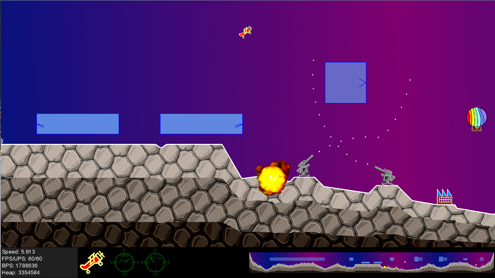
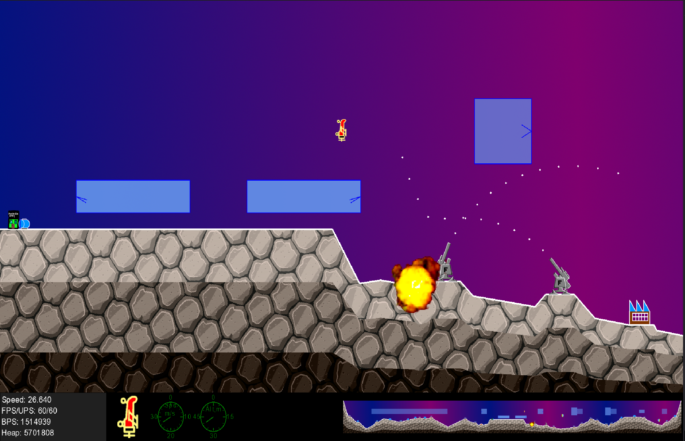
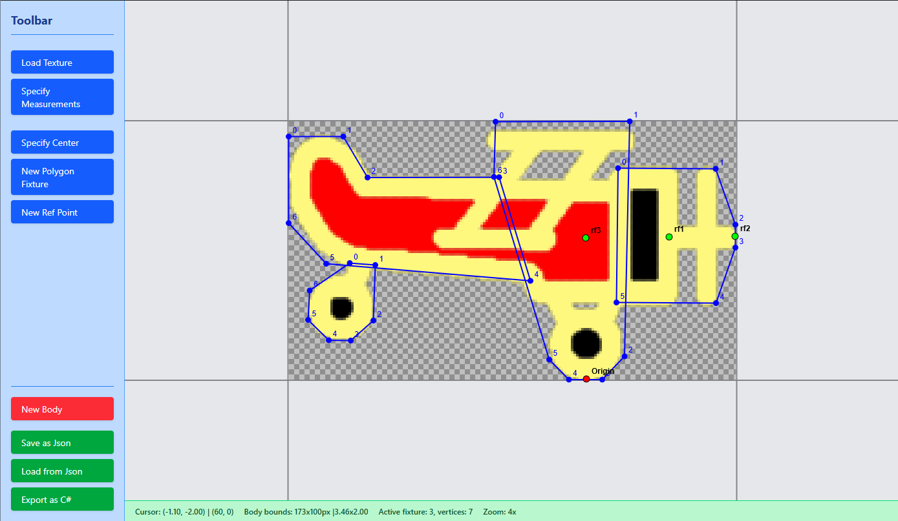

# VibeSopwith.Game.FNA Project

## What it is

I present you a personal experimental "game" project I started with two goals in mind:
- To further my learning of game development techniques, particularly in FNA/XNA space, and
- To explore potential to productively utilize "agentic AI" workflows for game coding. 

My inspiration was drawn from the venerable 1983 DOS game "Sopwith" ([Wikipedia link](https://en.wikipedia.org/wiki/Sopwith_(video_game))), or "Fly" as I knew it in the 1990s (because the executable  file was named "`fly.com`", of course - or was it "`fly.exe`"?), and its faithful [modern replica](http://www.sopwith.org/)

Now, if you stumbled upon my work while seeking only technical information associated with FNA/XNA, and you aren't interested in my musings, feel free to skip directly to the [next part](#to-higher-places). Everyone else who is willing to persevere, buckle up!

Having advanced a bit alongside the development arc I can confidently state that the project delivered a lot of value for me on the former goal, while failing utterly from the get-go on the latter. 

### "AI" detour

Let me get that latter statement out of way before I focus on the important matters. As evident from the name itself, the project has started with hope to unleash the "power" of modern "artificial intelligence" for realization of my "creative visions". Particularly of modern "agentic" tools and workflows. I harbour(ed) enough skepsis towards "vibe-coding" to be totally unenthusiastic to try it, but as it is sometimes attributed to Niels Bohr - "a horseshoe brings luck whether you believe in it or not" - I decided to jump in with open mind. 

I've already had another FNA game project started where I somewhat settled on chosen architecture, composition and code organisation. That project was/is called "Bin Blitz" (I am staking the name here :-)) and involved a garbage truck with moving arm and scattered around garbage bins of different colors - I may open up the repo some day. So the first task to "agent" (I tried VCode Copilot and Gemini CLI) was to research "Bin Blitz" code and identify/extract useful "patterns" and "invariants" (Copilot loves this word); to create a plan for Sopwith-inspired game; and to attempt reverse-engineer a prompt with which "Bin Blitz" could have been YOLO-ed into existence. Or even not YOLO-ed, just methodically brought into. 

It would be an understatement to say that both VSCode Copilot and Gemini CLI failed on the task. They *utterly, completely, undeniably, irredeemably failed*. I wasn't "vibing" at all - I spent the whole day arguing, steering, nudging, explaining, pushing, reframing, persuading, bribing, cajoling,  filling in markdown files of all kinds. I probably typed more text in aggregate prompts + markdowns than there was code in "Bin Blitz". Well, just kidding, but you get what I mean. In the end there was not a shred of code or another artifact out of that exercise that could be used in further development. The included [Architecture.md](src/Docs/Architecture.md) is a *fully authored by me* document attempting to show the agent what it *should have identified* and *how it should have presented the findings*. Yet even with that all my attempts were proven futile.

Some examples, from the top of my memory:
- Gemini CLI "identified" and adamantly insisted on strict adherence to "Model-View-Controller" pattern. My retort that not every case of logic/rendering separation fits MVC definition fell on deaf "ears".
- Both agents "identified" a lot of very trivial, superficial "patterns" while completely missing those that I considered fundamental for my code.
- I had to fight tooth and nail against their push towards certain "industry conventions", stylistic and structural. As a developer in the third decade of industry experience I am, of course, well aware about most conventions and reasoning behind them. But as a solo proprietor of this project I took liberty of intentionally deviating, not caring of, or even inverting some - in favor of locally-optimal well-justified patterns. 

All that I could take out of two days dancing with agent is another bucketload of evidence to add to my stash of "why agentic LLM coding isn't practical outside of few very explored well-patterned niches" - to put it mildly :-). If, for some reason, you want to hear more about it, contact me.

Saying so, I generally find LLMs of chatbot variety a very useful tools of assistance. So, while not a single line of VibeSopwith was written by *agentic* LLM, and the only remaining references are in the name and stale "Architecture.md", about 5%-10% of the codebase was assisted by Microsoft Copilot in some way. Usually of explanations, "framing" or "turbocharged search". Some local functions, especially with heavy-ish geometric transforms, were written by Copilot - although I ended up brushing line-by-line through each and every one of them, exterminating subtle bugs and wrongly interpreted "invariants" (did I tell you Copilot is in love with this word?) 

And while I hadn't forgotten. My attempts to use image-gen "AI" models to generate assets for this game fell flat even lower than lowest. I can confidently assert that useful overlap between current capabilities of image-gen models and needs of pixel-art-ish game developer is zero. If I was willing to climb the learning curve of tools like Comphy, I could probably move forward within epsilon-proximity (from the left! :-)), but I wasn't.
 
**TL;DR:**  "Agents" aren't there yet - at least for me. Chatbot LLM was useful. The codebase is 100% architected by me and 90% coded exclusively by me, and there is no nook or cranny in the remaining 10% which I'm not as familiar with as my own code. Except HLSL shaders - it does my head in, so I was happy to delegate them in entirety to Copilot! ;)

### To higher places!

Now that rant-of-frustration is behind me, I can proceed forward "Вперёд, к сияющим вершинам!"
So, what it is:

- An FNA-based game-like application demonstrating so far emergent techniques for
  - Composable rendering pipeline
  - Composable simulation pipeline with Actors and proto-ECS
  - Physics and collision simulation (I use Aether.Physics2D)
  - Spatial object composition
  - Animation pipeline
  - Code organisation
  - Assets organisation
  - Particle system simulation and rendering
  - Multi-platform deployment, including browser-wasm
  (See the important section [below](#what-it-is-not) for clarification)  

- A coding toy that I love to casually fire up - no, not to play - but to add or ponder another "feature", untangle another code conundrum or dare to try something I thought wasn't possible - which inevitably produces more conundrums for future entertainment!

- A basis to try out game building blocks set to be extracted into my "Not-a-Game-Engine-Strata" collection.

- Hopefully a useful example of FNA-based project for people who, like me, are frustrated with "big engines" and want to try their hand with FNA, but unable to find a better starting point. 

- A "portfolio item" which I hope to be able to point to, providing potential answers to certain questions from hiring teams around "ways of reasoning", "communication" or "raw coding ability". In other words, a hand-crafted alternative to CV that I hope humans may actually engage with, in the world of ubiquitous "AI".

## What it is not

- Not a finished game.
- It may not even be called a "game" - so fart there is no score, goals, levels or achievements of any kind.
- Not a tutorial or a general-purpose FNA template. All patterns here were discovered or stumbled upon by me during my experimenting, leveraging 25+ years of general software development experience. There is absolutely no assumptions to be made about them being conventional, endorsed by industry or suitable for larger-scale project.
- Not an example of "AI-driven development", let alone "Vibe-Coding".
- Not an example of "Anti-AI-driven development", let alone "Warm Vacuum-Tube Development".
- Not a polished product and never will be - it is an experiment, a learning tool, and a playground.
- It isn't a clone or replica or remake or even a "spiritual child" of original DOS "Sopwith", and uses no code or assets from that game. It is simply inspired by it.
- It is not an example of ossified set of rules or conventions or lack thereof that I am going to defend no-matter-what when working with a team. I fully understand the realities of team-based development and resulting need for coordination, conventions and compromise. 

## The Journey

There is so much I would like to share about milestones of this project or stumbling blocks I had to overcome! So much that at my pace of writing I would never be able to publish the project, if I'd postpone publishing until completion.
Those who might feel curious are welcome to attend [The Journey](Journey.md). There isn't much there yet, because any items I would like to share deserve their own write-up (or is it write-down?). And as learnings was mine, and victories and achievements were mine too, then writing about it cannot be "AI-assisted" in any way. Still, I hope to keep the pace somewhat steady, even if slow - keep an eye if interested.

## Overview

Still, I feel like a brief technical overview is in order.
Top-level project structure:

```plaintext
extern/
├── FNA/                          # Main FNA dependency. Git submodule
├── fnalibs/                      # FNA "native" prebuilt libraries for different architectures
├── Nage.Strata/                  # My "Not-A-Game-Engine" collection. Git submodule
│    
src/    
├── VibeSopwith.Game.csproj       # Core "game" logic as class library
├── Components                    # Rendering classes
├── Content                       # Assets. "Symbolic submodule"
├── Core                          # Game objects and associated logic
└── Docs                          # Not much in there
│
windows/
├── VibeSopwith.Game.Win.csproj   # Windows "build".
│
linux/
├── VibeSopwith.Game.Lin.csproj   # Linux "build".
│
wasm/
├── VibeSopwith.Game.Wasm.csproj  # Browser "build".
```

As evident from above, platform-wise the game is implemented as a class library referenced from corresponding "platform build" projects - Windows, Linux and WASM.

The game is backed by FNA.

"Native" libraries are downloaded from the official [fnalib-dailies](https://github.com/FNA-XNA/fnalibs-dailies) release page as of the time of development.

Browser-specific "natives" are copied from RedMike's sample project [FNA.WASM.Sample](https://github.com/RedMike/FNA.WASM.Sample).Huge thanks to [RedMike](https://github.com/RedMike) and his [guide](https://github.com/RedMike/FNA.WASM.Sample/wiki/Manually-setting-up-FNA-Project-for-WASM) for helping me set up WASM build!

Content lives in a separate repository [VibeSopwith.Content](https://github.com/fontmaniac/VibeSopwith.Content). The linking between main repo and Content repo is "symbolic", enabled by my homebrew "symbolic submodules" contraption [symgit](https://github.com/fontmaniac/symgit). 

The main reason is that I originally developed the project without thinking of opening it to anyone - and used some textures that I couldn't correctly attribute or show the license for. But later I suddenly felt the itch for publishing the repository with all original history, and because "git remembers everything" I realized the need for content decoupling and swapping with "clean" alternative. "Laundering", so to speak. For that I developed the whole "workflow" including `symgit` and git-history-replayer `dremmett`. `symgit` is opened and linked above, and `Dr.Emmett` is being prepared for publishing too - watch this space!

For physics simulation the game uses [`Aether.Physics2D`](https://github.com/nkast/Aether.Physics2D) fork.
For text rendering - [`MLEM.UI`](https://github.com/Ellpeck/MLEM)
Huge thanks to all authors and maintainers of those projects. 

`Aether.Physics2D` requires setting up "fixtures" for "physical bodies", which, naturally must approximately follow the contours of sprites as defined by used textures. For that reason you'd see a plenty of "magic numbers" in every game object definition. While it would be not atypical for me to painstakingly compute all these numbers using pen-and-paper approach, this time "AI agent" - namely Gemini CLI - was able to rescue me from such misery. With me cracking the whip it was able to vibe-shot me a React-based `"Aether Bodybuilder"` tool which enabled authoring "fixtures" and "reference points" using a specific texture as underlay. This tool is fully vibe-coded, to the extent that I either didn't look at the code or was utterly terrified when looking. As such, Aether Bodybuilder will never be opened! But here is a [screenshot](#aether-bodybuilder), for the curious of you.

Overall the "game" application follows pretty standard flow.

- [`TheGame` object](src/TheGame.cs) handles top-level drawing calls and user inputs. 
- User inputs are passed into [`GameWorld` object](src/Core/GameWorld.cs) simulation facility which handles all actions and interactions. 
- [`WorldRender` object](src/Components/WorldRender.cs) is the root of "render tree" which handles, well, rendering the world :-). 
- Some "out-of-world" object-renderers like *Dashboard*, *"Gizmo"* and *Dials* are "rootless" and directly handled by `TheGame`. 

One of the goals for me was to extract a useful set of "primitives" to reuse in my other FNA-based game projects. Which I was able to do, and that set is now open as [Nage.Strata](https://github.com/fontmaniac/Nage.Strata), and used as submodule dependency in this "game". It is under active development, but one day I hope to populate it with proper documentation and examples. At the time of writing there are none :-). However, the history of what became `Nage.Strata` can be tracked by looking back at the history of `VibeSopwith`. 


## How to run

- Clone the game repository. 
- Make sure submodules are updated recursively.
  `git submodule update --init --recursive`
  This will update `FNA` dependency and `Nage.Strata` dependency.
- Content repository must be cloned separately, as it lives in a detached [repository](https://github.com/fontmaniac/VibeSopwith.Content). 
  - Either clone it directly within `src/Content` directory (you'd have to create the directory):
  `git clone https://github.com/fontmaniac/VibeSopwith.Content.git .` 
  - Or utilise my `symbolic submodules` script. You can read more about it here: [symgit](https://github.com/fontmaniac/symgit). Run from the repo root:
  `dotnet fsi symgit.fsx update -all`
- Build the solution. 
- On Windows the VibeSopwith.Game.Win.csproj can be run from Visual Studio, or VSCode, or "published" and run directly.
- On Linux - which I am less familiar with - I could run VibeSopwith.Game.Lin.csproj with `dotnet run` or directly after `dotnet publish`
- The "game" runs in browser! However, I was unable to persuade Visual Studio to "publish" it properly. Command line dotnet worked though:
  - Ensure necessary dotnet tools are installed:
  ```
  dotnet workload install wasm-tools
  dotnet workload install wasm-experimental
  ```
  - Then run "publish" from within `wasm` directory:
  `dotnet publish -c Release`
  - Once published serve from the `wasm\bin\Release\net8.0\publish\wwwroot\`:
  `dotnet serve -o --port=8000`
  

## How to "play"

There is no "gameplay" (yet), but the little thing flies!
Default keybindings are the same as in original "Sopwith":
- **Z** - slow down
- **X** - accelerate
- **,** - pitch-up
- **.** - roll
- **/** - pitch-down
- **[space]** - shoot bullets
- **B** - drop bombs
- **H** - initiate auto-landing

There is an alternative, WASD-oriented control scheme, which can be enabled in the code.
Additionally, for now **0** will start spraying all water guns - ground-based and plane-mounted. 

## Licensing

Please strictly adhere to terms and conditions outlined in the [LICENSE](LICENSE.txt).
For asset attribution see [Readme.md at Content Repo](https://github.com/fontmaniac/VibeSopwith.Content)

## Collaboration

Feel free to fork and mutilate this "game" to your liking. 
Any issue, PR, critique or praise is welcome,
If you work in game development and see potential for collaboration, I would appreciate being considered.

## Screenshots

### Windows



### WASM



### Aether Bodybuilder

